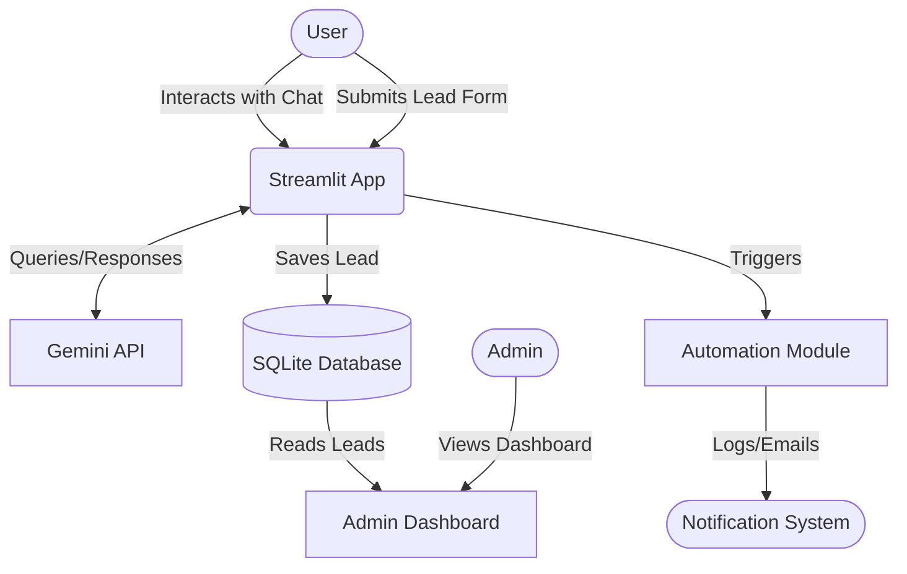
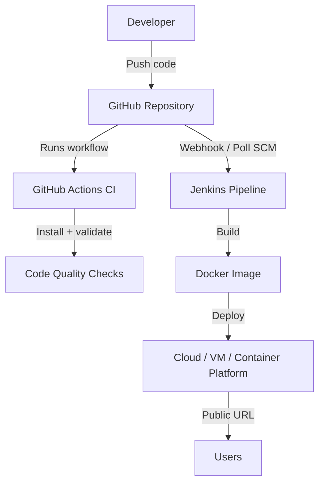

# AI-Powered Business Automation Assistant (NexFlow Assistant)

This project is an AI-powered business automation assistant built as part of the Codenixia assessment. It features a conversational AI interface, a lead capture system, an automated notification workflow, and an admin dashboard for data viewing.

## 🚀 Features

- **AI Assistant/Chatbot**: Built using the Gemini API, it can answer business and course-related queries interactively.
- **Lead Capture System**: A built-in form for users to submit their details (Name, Email, Phone, Query).
- **Data Storage**: Uses SQLite to persist lead data reliably.
- **Automation Workflow**: Simulates an automated process (e.g., email notification, internal Slack alert) upon lead submission via the Python `logging` module.
- **Admin Dashboard**: A separate view within the app to monitor captured leads, view statistics, and download data as CSV.
- **DevOps Support**: Includes Docker containerization, Jenkins pipeline support, and GitHub Actions CI validation.

## 🏗️ Architecture



## 🔁 DevOps Architecture



## 🛠️ Technology Stack

- **Frontend & UI**: Streamlit
- **Backend**: Python
- **Database**: SQLite
- **LLM API**: Google Gemini (gemini-2.5-flash)
- **Deployment**: Docker-ready
- **CI/CD**: Jenkins and GitHub Actions
- **Version Control**: GitHub

## 💻 Local Setup Instructions

1. **Clone the repository** (if applicable) or navigate to the project directory:
   ```bash
   cd NexFlow_Assistant
   ```

2. **Create a virtual environment** (recommended):
   ```bash
   python -m venv venv
   source venv/bin/activate  # On Windows: venv\Scripts\activate
   ```

3. **Install dependencies**:
   ```bash
   pip install -r requirements.txt
   ```

4. **Environment Variables**:
   Create a `.env` file in the root directory and add your Gemini API key:
   ```env
   GEMINI_API_KEY=your_gemini_api_key_here
   GEMINI_MODEL=gemini-2.5-flash
   ```
   *(Note: The application will run even without the key, but the AI chatbot will be in offline mode).*

5. **Run the Application**:
   ```bash
   streamlit run app.py
   ```

6. **Access the App**:
   Open your browser and navigate to `http://localhost:8501`.

## 🐳 Docker Deployment

To build and run the application using Docker:

1. **Build the image**:
   ```bash
   docker build -t nexflow-assistant .
   ```

2. **Run the container**:
   ```bash
   docker run -p 8501:8501 \
     -e GEMINI_API_KEY="your_api_key" \
     -e GEMINI_MODEL="gemini-2.5-flash" \
     nexflow-assistant
   ```

3. **Access the containerized app**:
   ```bash
   http://localhost:8501
   ```

## ⚙️ DevOps / CI-CD Support

This repository includes:

- `Dockerfile`: Builds a production-ready Streamlit container image.
- `.dockerignore`: Keeps secrets, local databases, caches, and virtual environments out of the Docker build context.
- `Jenkinsfile`: Defines a Jenkins pipeline for checkout, dependency installation, code validation, Docker build, and Docker Hub push using Jenkins credentials.
- `.github/workflows/ci.yml`: Runs GitHub Actions checks on push and pull request.
- `docs/devops.md`: Explains the Docker, Jenkins, GitHub Actions, and deployment workflow.

### Jenkins Pipeline Stages

1. Checkout source code from GitHub.
2. Create a Python virtual environment.
3. Install dependencies from `requirements.txt`.
4. Validate source files using `python -m compileall`.
5. Build a Docker image.
6. Push the image to Docker Hub using the Jenkins credential ID `DOCKERHUB_CREDENTIALS`.

### GitHub Actions Workflow

The GitHub Actions workflow automatically:

- Installs dependencies on Python 3.14.
- Compiles the application files.
- Builds the Docker image.

## ✅ Assessment Submission Checklist

- GitHub Repository Link: Add your repository URL here.
- Live Hosted Project Link: Add the deployed Streamlit/Render/Railway link here.
- Demo Video: Add your 5-7 minute walkthrough link here.
- Architecture Diagram: Included above using Mermaid.
- README / Documentation: Included in this file.
- DevOps Support: Docker, Jenkins, and GitHub Actions included.

## 🌐 Live Deployment
*(Add your live hosted link here after deploying to Streamlit Community Cloud, Render, or Railway)*

## 🎥 Demo Video
*(Add your 5-7 minute demo video link here)*
