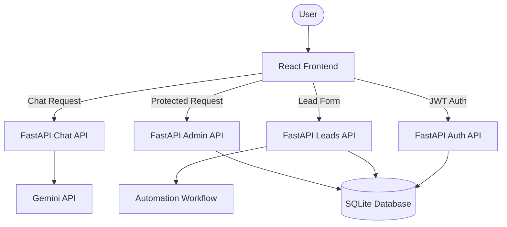
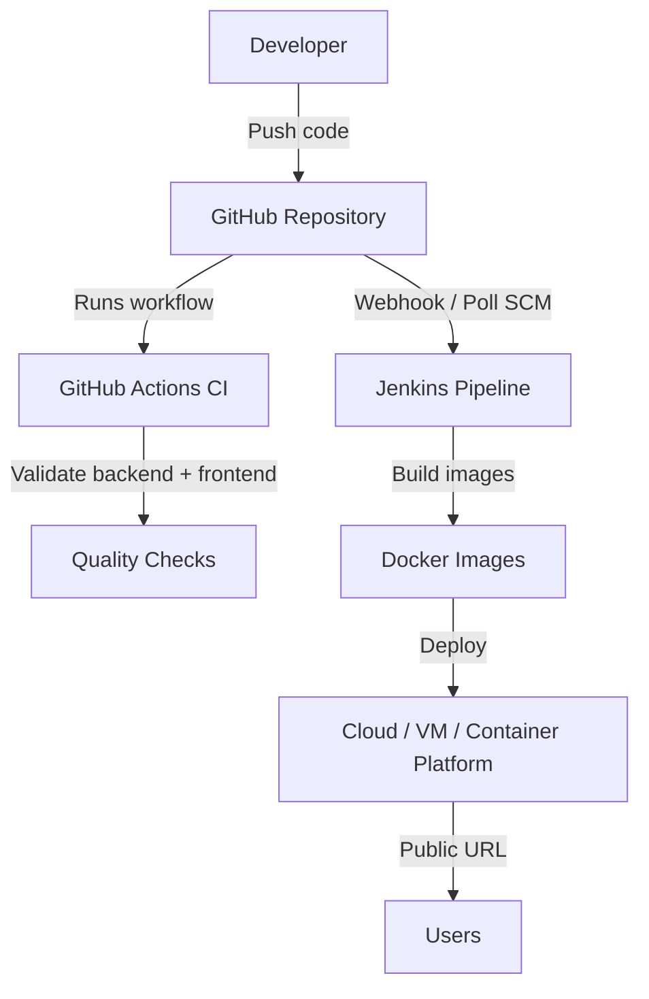

# AI-Powered Business Automation Assistant (NexFlow Assistant)

NexFlow Assistant is a 3-tier AI business automation system built for the Codenixia assessment. It includes a React frontend, FastAPI backend, SQLite persistence, Gemini-powered chat, lead capture automation, JWT authentication, and CI/CD support.

## Features

- **Landing Page**: Polished React landing page for the product experience.
- **Signup / Signin**: JWT-based authentication with secure password hashing.
- **AI Assistant / Chatbot**: Gemini-powered business and course query responses.
- **Lead Capture System**: Callback request form connected to the backend API.
- **Data Storage**: SQLite database with `users` and `leads` tables.
- **Automation Workflow**: Lead submission triggers backend notification logging.
- **Admin Dashboard**: Protected lead dashboard with metrics and CSV export.
- **DevOps Support**: Docker, Docker Compose, Jenkins, and GitHub Actions.

## Architecture



## DevOps Architecture



## Technology Stack

- **Frontend**: React, Vite, React Router, Lucide icons
- **Backend**: FastAPI, Python
- **Auth**: JWT with PBKDF2 password hashing
- **Database**: SQLite
- **LLM API**: Google Gemini (`gemini-2.5-flash`)
- **Legacy Demo**: Streamlit app retained in `app.py`
- **DevOps**: Docker, Docker Compose, Jenkins, GitHub Actions

## Project Structure

```text
NexFlow_Assistant/
├── backend/
│   ├── main.py
│   ├── auth.py
│   ├── ai.py
│   ├── database.py
│   ├── schemas.py
│   └── routes/
├── frontend/
│   ├── src/
│   │   ├── pages/
│   │   ├── components/
│   │   ├── App.jsx
│   │   └── api.js
│   ├── Dockerfile
│   └── package.json
├── Dockerfile
├── docker-compose.yml
├── Jenkinsfile
└── .github/workflows/ci.yml
```

## Environment Variables

Create `.env` in the project root:

```env
GEMINI_API_KEY=your_gemini_api_key_here
GEMINI_MODEL=gemini-2.5-flash
JWT_SECRET=replace_with_a_long_random_secret
JWT_EXPIRE_HOURS=24
DATABASE_PATH=nexflow_data.db
```

For the frontend, create `frontend/.env` if your API URL is different:

```env
VITE_API_URL=http://localhost:8000
```

## Local Setup

Install backend dependencies:

```bash
python -m venv venv
source venv/bin/activate
python -m pip install -r requirements.txt
```

Run the FastAPI backend:

```bash
uvicorn backend.main:app --reload --host 0.0.0.0 --port 8000
```

Install and run the React frontend:

```bash
cd frontend
npm install
npm run dev
```

Open:

```text
Frontend: http://localhost:5173
Backend API: http://localhost:8000
API Docs: http://localhost:8000/docs
```

The first registered user automatically gets the `admin` role. Later users get the `user` role.

## Docker Deployment

Run both tiers with Docker Compose:

```bash
docker compose up --build
```

Open:

```text
Frontend: http://localhost:5173
Backend API: http://localhost:8000
```

Build images separately:

```bash
docker build -t nexflow-backend .
docker build -t nexflow-frontend ./frontend
```

## Vercel Deployment

Deploy the React frontend on Vercel:

```text
Root Directory: frontend
Framework Preset: Vite
Build Command: npm run build
Output Directory: dist
Install Command: npm install
```

Set this Vercel environment variable:

```env
VITE_API_URL=https://your-backend-api-url
```

The FastAPI backend should be deployed separately on a persistent backend host because the app stores users and leads in SQLite. See `docs/vercel.md` for the full Vercel checklist.

## DevOps / CI-CD Support

This repository includes:

- `Dockerfile`: Builds the FastAPI backend image.
- `frontend/Dockerfile`: Builds the React frontend and serves it with Nginx.
- `docker-compose.yml`: Runs backend and frontend together.
- `Jenkinsfile`: Validates code, builds frontend, builds Docker images, and pushes to Docker Hub.
- `.github/workflows/ci.yml`: Runs backend validation, frontend build, and Docker image builds.
- `docs/devops.md`: Documents Docker, Jenkins, and GitHub integration.
- `docs/vercel.md`: Documents Vercel frontend deployment.

## Jenkins Notes

Required Jenkins setup:

- Git, Docker, and Python 3.14 installed on the Jenkins agent.
- Node.js is not required on Jenkins because the frontend Dockerfile builds React inside `node:22-alpine`.
- Docker Hub username/password credential:
  - **ID**: `DOCKERHUB_CREDENTIALS`
  - **Username**: Docker Hub username, for example `priyanshuksharma`
  - **Password**: Docker Hub password or access token

## Assessment Submission Checklist

- GitHub Repository Link: Add your repository URL here.
- Live Hosted Project Link: Add the deployed frontend link here.
- Backend API Link: Add the deployed backend link here.
- Demo Video: Add your 5-7 minute walkthrough link here.
- Architecture Diagram: Included above using Mermaid.
- README / Documentation: Included in this file.
- DevOps Support: Docker, Jenkins, and GitHub Actions included.

## Live Deployment

Add your deployed frontend and backend links here after hosting.

## Demo Video

Add your 5-7 minute demo video link here.
