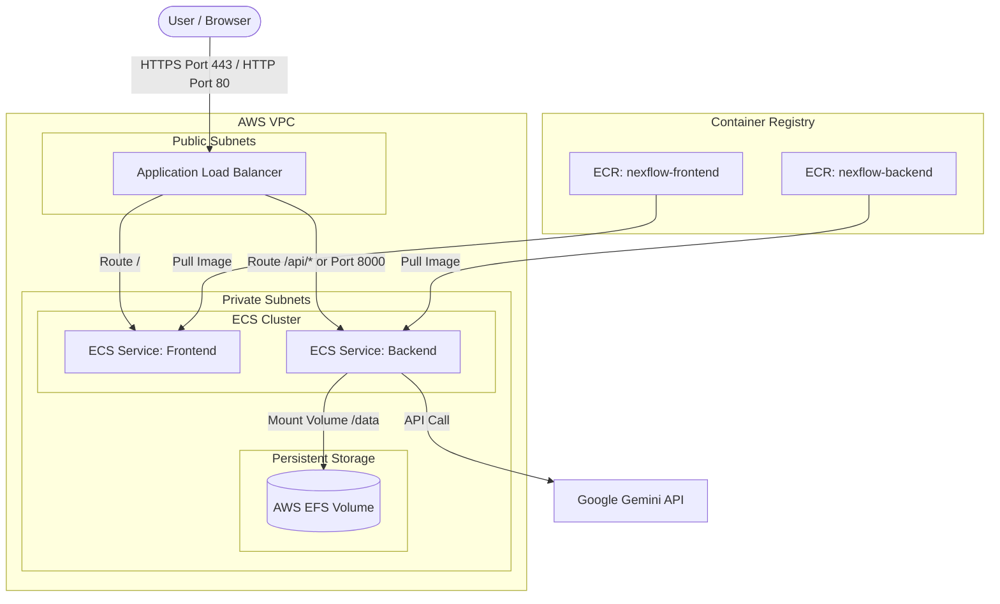

# AWS ECS (Fargate) & ECR Deployment Guide

This guide provides step-by-step instructions to deploy the **NexFlow Assistant** (FastAPI backend + React frontend) to **AWS ECS (Elastic Container Service)** using **AWS Fargate** (serverless containers), **AWS ECR (Elastic Container Registry)** for hosting images, and **AWS EFS (Elastic File System)** to persist the SQLite database.

---

## Architecture Diagram

Here is how the architecture looks on AWS:



---

## Prerequisites

1. **AWS CLI** installed and configured (`aws configure`).
2. **Docker** installed and running locally.
3. An active **Google Gemini API Key** and your desired **JWT Secret**.

---

## Step 1: Create ECR Repositories and Push Images

We need to create two Elastic Container Registry (ECR) repositories: one for the backend and one for the frontend.

### 1. Authenticate Docker with AWS ECR
Run this command in your local terminal to log your local Docker daemon into ECR (replace `us-east-1` with your AWS region and `123456789012` with your AWS Account ID):
```bash
aws ecr get-login-password --region us-east-1 | docker login --username AWS --password-stdin 123456789012.dkr.ecr.us-east-1.amazonaws.com
```

### 2. Create the ECR Repositories
Create the ECR repositories for the backend and the frontend:
```bash
# Create Backend Repo
aws ecr create-repository --repository-name nexflow-backend --region us-east-1

# Create Frontend Repo
aws ecr create-repository --repository-name nexflow-frontend --region us-east-1
```

### 3. Build, Tag, and Push the Backend Image
From the root of the project (`/home/priyanshuksharma/Desktop/NexFlow_Assistant`):
```bash
# Build the backend image
docker build -t nexflow-backend -f Dockerfile .

# Tag the image for ECR
docker tag nexflow-backend:latest 123456789012.dkr.ecr.us-east-1.amazonaws.com/nexflow-backend:latest

# Push the image to ECR
docker push 123456789012.dkr.ecr.us-east-1.amazonaws.com/nexflow-backend:latest
```

### 4. Build, Tag, and Push the Frontend Image
> [!IMPORTANT]
> The React/Vite frontend embeds environment variables at **build time**. You must pass the public HTTPS URL of your future Application Load Balancer (or domain) as the `VITE_API_URL` build argument.

Assuming your Load Balancer's DNS name or domain will be `https://nexflow.yourdomain.com` (or the ALB DNS name):
```bash
# Build the frontend image with the production API URL build arg
docker build -t nexflow-frontend --build-arg VITE_API_URL=https://nexflow.yourdomain.com -f frontend/Dockerfile ./frontend

# Tag the image for ECR
docker tag nexflow-frontend:latest 123456789012.dkr.ecr.us-east-1.amazonaws.com/nexflow-frontend:latest

# Push the image to ECR
docker push 123456789012.dkr.ecr.us-east-1.amazonaws.com/nexflow-frontend:latest
```

---

## Step 2: Set up Persistent Storage (AWS EFS)

Because Fargate containers are ephemeral (their files disappear when restarted) and the app uses SQLite (`nexflow_data.db`), we need to attach an **AWS EFS (Elastic File System)** volume to the backend ECS task.

1. **Create an EFS File System**:
   Go to the AWS Console -> EFS -> **Create File System**.
   - Choose your custom VPC.
   - Name it `nexflow-efs`.
2. **Create EFS Mount Targets**:
   - Ensure EFS mount targets are created in all private/public subnets of your VPC.
   - Note the **File System ID** (e.g., `fs-0a1b2c3d4e5f6g7h8`).
3. **Configure Security Groups**:
   - Create a Security Group for EFS (e.g., `nexflow-efs-sg`) that allows inbound **NFS (Port 2049)** traffic from your ECS Task security group.

---

## Step 3: Create ECS Task Definitions

We will create two separate ECS Fargate task definitions.

### 1. Backend Task Definition (`nexflow-backend-task`)

Create a JSON file named `backend-task.json` and register it using the AWS CLI or create it in the AWS Console:

```json
{
  "family": "nexflow-backend-task",
  "networkMode": "awsvpc",
  "requiresCompatibilities": ["FARGATE"],
  "cpu": "256",
  "memory": "512",
  "containerDefinitions": [
    {
      "name": "nexflow-backend",
      "image": "123456789012.dkr.ecr.us-east-1.amazonaws.com/nexflow-backend:latest",
      "portMappings": [
        {
          "containerPort": 8000,
          "hostPort": 8000,
          "protocol": "tcp"
        }
      ],
      "essential": true,
      "environment": [
        { "name": "GEMINI_MODEL", "value": "gemini-2.5-flash" },
        { "name": "JWT_EXPIRE_HOURS", "value": "24" },
        { "name": "DATABASE_PATH", "value": "/data/nexflow_data.db" },
        { "name": "CORS_ORIGINS", "value": "https://nexflow.yourdomain.com,http://localhost:5173" }
      ],
      "secrets": [
        { "name": "GEMINI_API_KEY", "valueFrom": "arn:aws:ssm:us-east-1:123456789012:parameter/GEMINI_API_KEY" },
        { "name": "JWT_SECRET", "valueFrom": "arn:aws:ssm:us-east-1:123456789012:parameter/JWT_SECRET" }
      ],
      "mountPoints": [
        {
          "sourceVolume": "nexflow-efs-volume",
          "containerPath": "/data",
          "readOnly": false
        }
      ]
    }
  ],
  "volumes": [
    {
      "name": "nexflow-efs-volume",
      "efsVolumeConfiguration": {
        "fileSystemId": "fs-0a1b2c3d4e5f6g7h8",
        "rootDirectory": "/"
      }
    }
  ]
}
```
*Note: Make sure to store your sensitive `GEMINI_API_KEY` and `JWT_SECRET` in **AWS Systems Manager Parameter Store** or **Secrets Manager**.*

### 2. Frontend Task Definition (`nexflow-frontend-task`)

Create a JSON file named `frontend-task.json`:

```json
{
  "family": "nexflow-frontend-task",
  "networkMode": "awsvpc",
  "requiresCompatibilities": ["FARGATE"],
  "cpu": "256",
  "memory": "512",
  "containerDefinitions": [
    {
      "name": "nexflow-frontend",
      "image": "123456789012.dkr.ecr.us-east-1.amazonaws.com/nexflow-frontend:latest",
      "portMappings": [
        {
          "containerPort": 80,
          "hostPort": 80,
          "protocol": "tcp"
        }
      ],
      "essential": true
    }
  ]
}
```

### Register the Task Definitions:
```bash
aws ecs register-task-definition --cli-input-json file://backend-task.json --region us-east-1
aws ecs register-task-definition --cli-input-json file://frontend-task.json --region us-east-1
```

---

## Step 4: Configure Networking & Application Load Balancer (ALB)

To route users properly to both tiers under a single DNS name, we set up an ALB.

1. **Create an Application Load Balancer**:
   - Scheme: **Internet-facing**.
   - Subnets: Choose at least two Public Subnets in different Availability Zones.
2. **Create Target Groups**:
   - **TG-Frontend**: Port `80`, Protocol `HTTP`, Target Type `IP`. Health Check Path: `/`.
   - **TG-Backend**: Port `8000`, Protocol `HTTP`, Target Type `IP`. Health Check Path: `/health`.
3. **Configure ALB Listeners & Routing Rules**:
   - **HTTP (Port 80) Listener**:
     - Route all general traffic (`/` or `/*`) to **TG-Frontend**.
     - Route all API traffic (`/api/*` or path `/api`) to **TG-Backend**.
     - *Alternative*: Run the backend on a separate listener port, such as HTTPS Port 8000 or HTTP Port 8000 routing directly to **TG-Backend**.

---

## Step 5: Create ECS Cluster and Fargate Services

### 1. Create the ECS Cluster
```bash
aws ecs create-cluster --cluster-name nexflow-cluster --region us-east-1
```

### 2. Create the Backend Service
Create the service and link it to the backend target group:
```bash
aws ecs create-service \
  --cluster nexflow-cluster \
  --service-name nexflow-backend-service \
  --task-definition nexflow-backend-task:latest \
  --desired-count 1 \
  --launch-type FARGATE \
  --network-configuration "awsvpcConfiguration={subnets=[subnet-private1,subnet-private2],securityGroups=[sg-backend],assignPublicIp=ENABLED}" \
  --load-balancers "targetGroupArn=arn:aws:elasticloadbalancing:us-east-1:123456789012:targetgroup/TG-Backend/1a2b3c4d,containerName=nexflow-backend,containerPort=8000" \
  --region us-east-1
```

### 3. Create the Frontend Service
Create the service and link it to the frontend target group:
```bash
aws ecs create-service \
  --cluster nexflow-cluster \
  --service-name nexflow-frontend-service \
  --task-definition nexflow-frontend-task:latest \
  --desired-count 1 \
  --launch-type FARGATE \
  --network-configuration "awsvpcConfiguration={subnets=[subnet-private1,subnet-private2],securityGroups=[sg-frontend],assignPublicIp=ENABLED}" \
  --load-balancers "targetGroupArn=arn:aws:elasticloadbalancing:us-east-1:123456789012:targetgroup/TG-Frontend/5e6f7g8h,containerName=nexflow-frontend,containerPort=80" \
  --region us-east-1
```

---

## Step 6: Verifying Deployment

Once the ECS tasks transition to the `RUNNING` status and the target groups show healthy targets:
1. Open your browser and navigate to the Application Load Balancer DNS name or your custom domain (e.g. `https://nexflow.yourdomain.com`).
2. Verify that the React page loads.
3. Test a login or chatbot request. The request will route to the ALB, which will pass it to the backend container, query the Gemini API, read/write to the SQLite database persistent on EFS, and successfully return the response!
