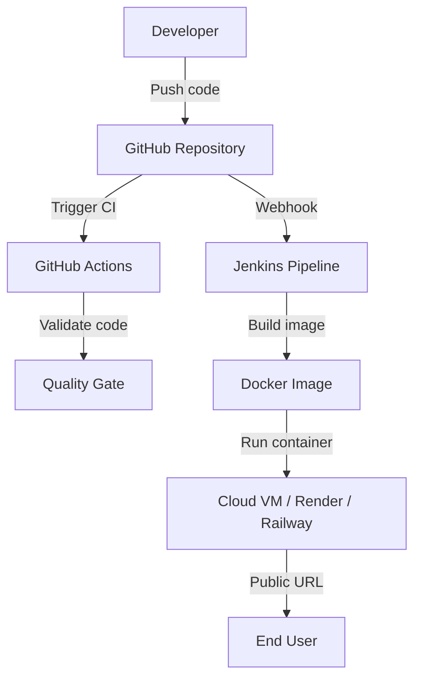

# DevOps Support

This project includes Docker, Jenkins, and GitHub Actions support for repeatable builds and deployment readiness.

## Docker

Build the application image:

```bash
docker build -t nexflow-assistant .
```

Run the container:

```bash
docker run -p 8501:8501 -e GEMINI_API_KEY="your_gemini_api_key" nexflow-assistant
```

Open:

```text
http://localhost:8501
```

## Jenkins CI/CD

The `Jenkinsfile` defines these stages:

1. Checkout source code from GitHub.
2. Create a Python virtual environment.
3. Install project dependencies.
4. Validate Python source files with `compileall`.
5. Build the Docker image.
6. Optionally push the image to Docker Hub when Docker credentials are configured.

Expected Jenkins setup:

- Jenkins server with Git, Python 3.14, and Docker installed.
- Pipeline job connected to the GitHub repository.
- Optional environment variables for Docker Hub publishing:
  - `DOCKERHUB_USERNAME`
  - `DOCKERHUB_TOKEN`

## GitHub Actions

The `.github/workflows/ci.yml` workflow runs on pushes and pull requests. It:

- Installs dependencies on Python 3.14.
- Compiles the application source files.
- Builds the Docker image.

This gives every GitHub commit a basic quality gate before deployment.

## Suggested Deployment Flow



## Assessment Mapping

- **Docker**: Containerized deployment support.
- **Jenkins**: CI/CD pipeline for build validation and image creation.
- **GitHub Integration**: Repository-based workflow with automated checks.
- **Deployment Readiness**: The same Docker image can be used on a VM, Render, Railway, or other container platforms.
