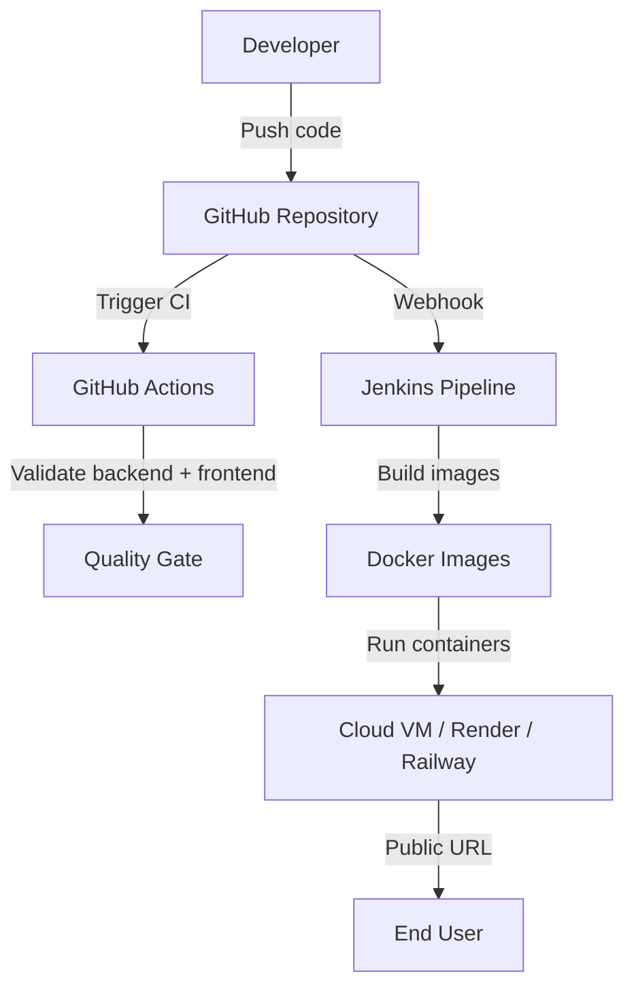

# DevOps Support

This project includes Docker, Docker Compose, Jenkins, and GitHub Actions support for the React + FastAPI 3-tier architecture.

## Docker

Build the backend image:

```bash
docker build -t nexflow-backend .
```

Build the frontend image:

```bash
docker build -t nexflow-frontend ./frontend
```

Run both services together:

```bash
docker compose up --build
```

Open:

```text
Frontend: http://localhost:5173
Backend API: http://localhost:8000
API Docs: http://localhost:8000/docs
```

## Jenkins CI/CD

The `Jenkinsfile` defines these stages:

1. Checkout source code from GitHub.
2. Create a Python virtual environment.
3. Install backend dependencies.
4. Validate Python source files with `compileall`.
5. Install and build the React frontend.
6. Build backend and frontend Docker images.
7. Push both images to Docker Hub using Jenkins credentials.

Expected Jenkins setup:

- Jenkins server/agent with Git, Docker, Python 3.14, Node.js 22, and npm installed.
- Pipeline job connected to the GitHub repository.
- Jenkins username/password credential for Docker Hub:
  - **ID**: `DOCKERHUB_CREDENTIALS`
  - **Username**: Docker Hub username, for example `priyanshuksharma`
  - **Password**: Docker Hub password or access token

The pipeline reads this credential with Jenkins `withCredentials`, so the Docker Hub password is not stored in code or printed in logs.

## GitHub Actions

The `.github/workflows/ci.yml` workflow runs on pushes and pull requests. It:

- Installs backend dependencies on Python 3.14.
- Compiles the backend and legacy Streamlit source files.
- Installs and builds the React frontend on Node.js 22.
- Builds backend and frontend Docker images.

This gives every GitHub commit a basic quality gate before deployment.

## Suggested Deployment Flow



## Assessment Mapping

- **Docker**: Separate backend and frontend container images.
- **Docker Compose**: Local full-stack deployment.
- **Jenkins**: CI/CD pipeline for validation, image build, and Docker Hub push.
- **GitHub Integration**: Repository-based workflow with automated checks.
- **Deployment Readiness**: Backend can deploy to Render/Railway/VM, frontend can deploy to Vercel/Netlify/Nginx container.
